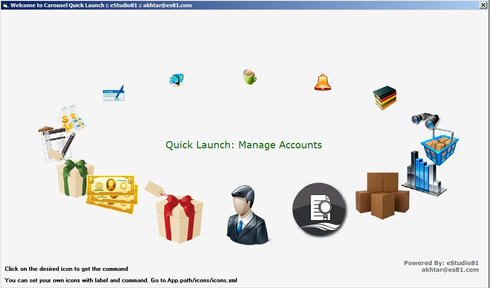



## Fantastic Carousel Menu

### Description

The power of Flash along with VB6.

A brand new style in menu for animated vb6 lovers.

Hi fellows..

to set icons, edit labels and action command

follow me....

go to the icons folder and edit icons.xml

Example: <th>

Icons you want to set goes here thumbnail filename="youricon.png"

label="Hi your mouse is over me"

url="Hi you clicked me"

I am here at planet source code from last 6 years approx and really this site rocks, either you are here to

learn or share.

Hope you guys like it and use it but dont forget to vote..

thanks in advance
 
### More Info
 

             |
---                |---
**Submitted On**   |2009-04-27 09:48:38
**By**             |[Muhammad Akhtar](https://github.com/Planet-Source-Code/PSCIndex/blob/master/ByAuthor/muhammad-akhtar.md)
**Level**          |Beginner
**User Rating**    |4.8 (81 globes from 17 users)
**Compatibility**  |VB 6\.0
**Category**       |[Custom Controls/ Forms/  Menus](https://github.com/Planet-Source-Code/PSCIndex/blob/master/ByCategory/custom-controls-forms-menus__1-4.md)
**World**          |[Visual Basic](https://github.com/Planet-Source-Code/PSCIndex/blob/master/ByWorld/visual-basic.md)
**Archive File**   |[Fantastic\_2151084302009\.zip](https://github.com/Planet-Source-Code/muhammad-akhtar-fantastic-carousel-menu__1-72052/archive/master.zip)

